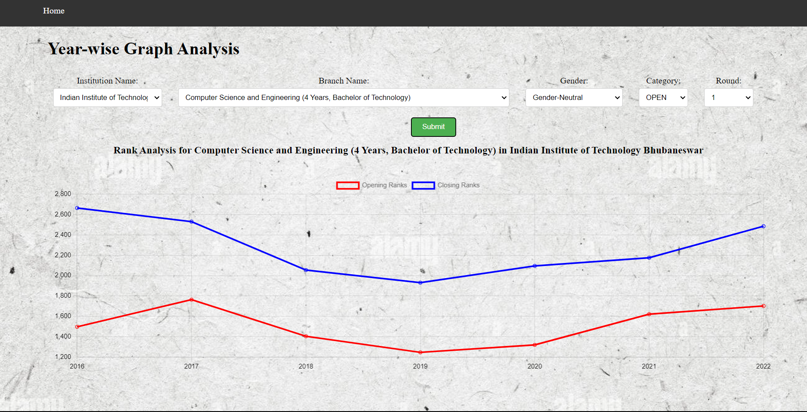

This README file provides an overview and instructions for the JOSAA Analyser website project. The website scrapes data from the JOSAA website using the `selenium` library, converts it into a DataFrame using `pandas`, performs data cleaning and exploratory data analysis (EDA), and finally saves the cleaned data into a MySQL database. The project utilizes Django as the backend framework and HTML, CSS, and JavaScript for the frontend. The graphs are generated using Chart.js and Matplotlib.

## Table of Contents
- [Project Overview](#project-overview)
- [Installation](#installation)
- [Usage](#usage)

## Project Overview
The JOSAA Analyser website project aims to provide an interface to scrape, analyze, and visualize data from the JOSAA (Joint Seat Allocation Authority) website. The project incorporates the following key components and technologies:

- **selenium**: A powerful library for automating web browsers, used to scrape data from the JOSAA website by interacting with web elements and extracting information.
- **pandas**: A versatile data manipulation library in Python, utilized to convert the scraped data into a structured DataFrame, perform data cleaning operations, and enable exploratory data analysis.
- **MySQL**: A popular open-source relational database management system, employed to store the cleaned data in a database for easy retrieval and querying.
- **Django**: A high-level Python web framework that simplifies the development of web applications, used as the backend framework for handling requests, data processing, and database operations.
- **HTML, CSS, and JavaScript**: Standard web technologies for building the frontend of the website, responsible for user interface design, interactivity, and data visualization.
- **Chart.js and Matplotlib**: JavaScript and Python libraries, respectively, for generating graphs and visualizations based on the cleaned and analyzed data.

By combining these technologies, the JOSAA Analyser website project enables users to scrape, clean, analyze, and visualize data from the JOSAA website, facilitating better insights and decision-making.

## Installation
To set up the JOSAA Analyser website project on your local machine, follow these steps:

1. Clone the project repository from GitHub

2. Navigate to the project directory

3. Create a virtual environment (optional but recommended) and activate it:

   ```
   python3 -m venv venv
   source venv/bin/activate
   ```

4. Install the required libraries using pip:

   ```
   pip install selenium pandas django mysqlclient
   ```

   Ensure that you have Python and pip installed on your system, as well as a compatible web driver for selenium (e.g., ChromeDriver for Google Chrome).

5. Install MySQL and set up a database for the project. Refer to the MySQL documentation for detailed instructions on installation and configuration.

6. Configure the database settings in the Django project's settings file (`settings.py`). Update the database host, port, name, user, and password according to your MySQL setup.

## Usage
After completing the installation steps and configuring the database, you can start using the JOSAA Analyser website by running the Django server. Here's how:

1. Make sure you are in the project directory.

2. Start the Django development server:

   ```
   python manage.py runserver
   ```

3. Access the website by opening a web browser and navigating to

 `http://127.0.0.1:8000`.

4. Explore various sections in the website to get all-round analysis of various JOSAA rounds over past few years

Here are some glimpses of how it works
 


### Contributors

- Harshavardhani Thota ([@harshavardhani07](https://github.com/harshavardhani07))
- Hithesh Reddy Kanumukkala([@quadwipe](https://github.com/quadwipe))
- Nikhitha Vanga ([@Nikhitha284](https://github.com/Nikhitha284))
- NV Koushik ([@NVKoushik](https://github.com/NVKoushik))
